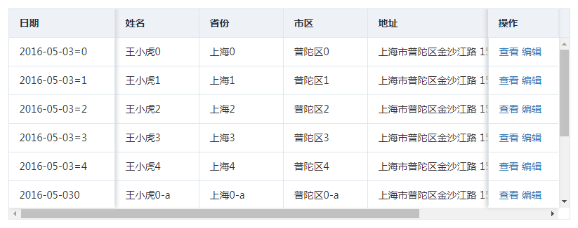

# FixedTable
fixedTable是普通table的一个变体，在后台管理中我们经常使用表格，一个表格会有很多的列，并且每一列的长度还必须那么长，可能最后一列会有很多的操作按钮，这就会导致有很多的列会换行，这样就不美观了。对于这样的表格我们该怎么办呢？最简单的办法就是说服产品，跟他说"你这个表格不能有那么多的列，否则最后一列的按钮就放不下了，会出现换行的效果，这样就不美观了！"。那除了这个办法还有别的办法没？答案是有的。FixedTable就是其中的解决方案之一！

# 文档地址
[https://941477276.github.io/FixedTable/doc/index.html](https://941477276.github.io/FixedTable/doc/index.html)